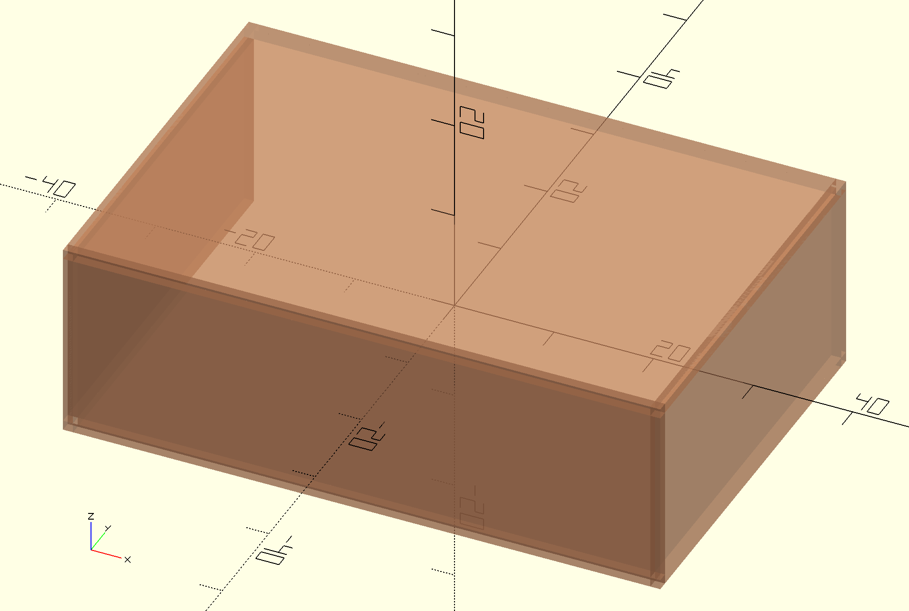
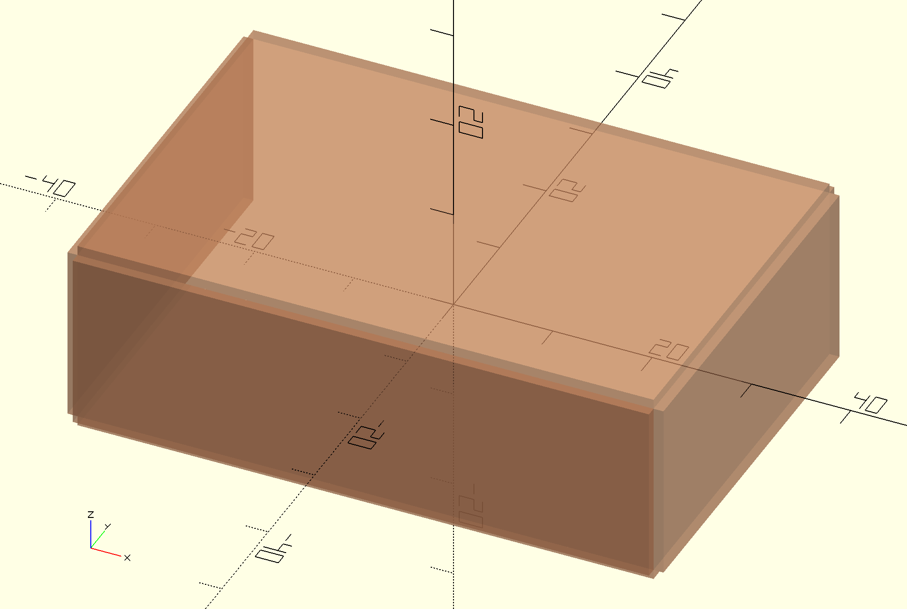

# OpenSCAD Aesthetic Cube

This repository includes an OpenSCAD module for drawing a cube which comprises
of individual cubes representing its faces, edges and corners.

The cude has an `inset` argument which determines several values in one number:
the depth of all the face cubes, the size of all the square faces of edge ends
and the size of all the cubes making the cube corners.

By default, `aesthetic_cube` renders all faces, edges and corners making it
appear as a normal cube:



The signature of the module has four required parameters:
`width`, `depth`, `height` and `inset`.

The individual sub-cubes are controlled via optional parameters which all
default to `true` and are self-explanatory:

- `leftFace`
- `rightFace`
- `topFace`
- `bottomFace`
- `backFace`
- `frontFace`
- `leftTopEdge`
- `rightTopEdge`
- `leftBottomEdge`
- `rightBottomEdge`
- `leftBackEdge`
- `rightBackEdge`
- `leftFrontEdge`
- `rightFrontEdge`
- `topBackEdge`
- `topFrontEdge`
- `bottomBackEdge`
- `bottomFrontEdge`
- `leftTopBackCorner`
- `leftTopFrontCorner`
- `rightTopBackCorner`
- `rightTopFrontCorner`
- `leftBottomBackCorner`
- `leftBottomFrontCorner`
- `rightBottomBackCorner`
- `rightBottomFrontCorner`

A cube with only faces but no edges or corners would look like this:



## Installation

Use Git Modules to check out this repository as a submodule of your repository.

Reference the module via the standard OpenSCAD `use` directive:

```openscad
use <openscad-aesthetic-cube/aesthetic_cube.scad>

// Pass any of the above arguments to turn individual cube features on/off.
aesthetic_cube(
    60,
    40,
    20,
    1
);
```
